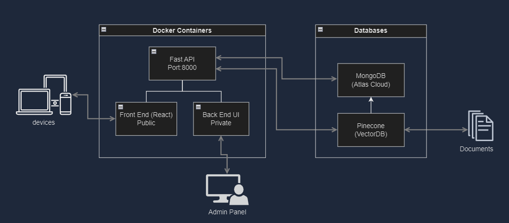

# MDC CIOL TA v0.0.1

### Installation

1. **Clone the repository**:

   ```bash
   git clone [https://github.com/triveradev/trudata.git](https://github.com/ReneMazuela/Demo.git)
   ```

2. **CD into the Trudata directory**:

   ```bash
   cd Demo
   ```


3. **Build and run the Docker containers for bot FastAPI and React**:

   ```bash
   docker compose up --build -d
   ```
## About

The MDC CIOL Training Assistant (CTA) is a state-of-the-art chatbot application designed to streamline the learning and administrative processes within the College's MDC CIOL Program. With a focus on utilizing advanced Artificial Intelligence (AI) and Natural Language Processing (NLP) technologies, the CTA is engineered to offer an intuitive, interactive, and enriching experience for both students and faculty members.

This documentation aims to assist with configuring and deploying the CTA. Some Key Features of the application include:

### Automated FAQ Management:

The CTA autonomously handles routine inquiries, effectively reducing the administrative overhead and allowing faculty to focus on more critical engagements.
A dynamically evolving Knowledge Base ensures the most current information is always accessible.

### Distraction Avoidance:

The CTA remains focused on the topic, avoiding deviations into unrelated topics. CTA filters out irrelevant information or distractions during classroom sessions, ensuring discussions remain on-topic and productive.

### Real-Time Communication:

real-time interactions between students, faculty, and the CTA. Provides a centralized place for course discussions, queries, and collaborations.

### Scalable Architecture:

Designed with a modular and scalable architecture, The CTA can evolve alongside the expanding needs of the MDC CIOL program.
This ensures seamless integration, laying a foundation for future advancements.




## Getting Started

These instructions will help you set up and run the project locally.

### Prerequisites

Before you begin, ensure you have met the following requirements:

**FastAPI Service:**
- [Docker](https://www.docker.com/get-started): Required for containerization.
- [Python](https://www.python.org/downloads/): Version 3.6 or higher is needed.
- [FastAPI](https://fastapi.tiangolo.com/): You can install it via `pip install fastapi`.
- [Uvicorn](https://www.uvicorn.org/): You can install it via `pip install uvicorn`.

**React Service:**

- [Node.js](https://nodejs.org) (version 9.5.1)
- [npm](https://www.npmjs.com) or [Yarn](https://yarnpkg.com) 

These prerequisites are essential to get started with the project. Follow the installation guides linked above to set up the necessary tools and frameworks.
